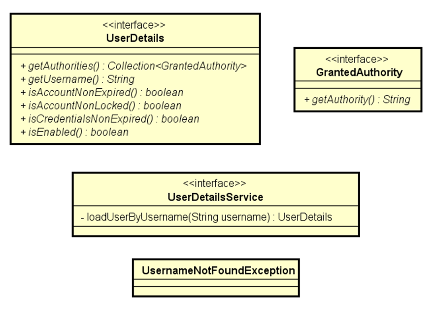

# Spring Boot OAuth2 JWT Demo (password grant type)

Our reference minimum implementations for using OAuth2 Authorization Server and Resource Server with Spring Boot, using password grant type, and user/roles from a database.

## Postman Collection and Environment:
Download them from this folder.

## How to run:

- Import Postman collection and environment
  - Note: the Login request path may be `/oauth2/token` or `/oauth/token` depending on Spring Boot version. Change request path if needed.
  - Note: the `ashost` environment variable must be set to `http://localhost:8080` if you're running a project that contains both Authorization Server and Resource Server. 

- Open Spring Boot project(s) in your favorite IDE and run

- Tests on Postman:
  - PART 1: not logged
    - Request GET /products (should return products)
    - Request GET /products/1 (should return 401)
    - Request POST /products {"name":"Tablet"} (should return 401)
  - PART 2: logged as Alex
    - Set alex@gmail.com as username in Postman environment
    - Request login request (should return 200 Ok with JWT token. That token will be saved on 'token' environment variable)
    - Request GET /products (should return products)
    - Request GET /products/1 (should return product)
    - Request POST /products {"name":"Tablet"} (should return 403) 
  - PART 3: logged as Maria
    - Set maria@gmail.com as username in Postman environment
    - Request login request (should return 200 Ok with JWT token. That token will be saved on 'token' environment variable)
    - Request GET /products (should return products)
    - Request GET /products/1 (should return product)
    - Request POST /products {"name":"Tablet"} (should insert product) 

## Data Model User With Roles:


## Mapping N-N
```
@ManyToMany
@JoinTable(name = "tb_user_role",
        joinColumns = @JoinColumn(name = "user_id"),
        inverseJoinColumns = @JoinColumn(name = "role_id"))
private Set<Role> roles = new HashSet<>();
```

## SEED DataBase 
### Without encrypt
```
INSERT INTO tb_role (authority) VALUES ('ROLE_OPERATOR');
INSERT INTO tb_role (authority) VALUES ('ROLE_ADMIN');

INSERT INTO tb_user_role (user_id, role_id) VALUES (1, 1);
INSERT INTO tb_user_role (user_id, role_id) VALUES (2, 1);
INSERT INTO tb_user_role (user_id, role_id) VALUES (2, 2);
```

## Spring Security Dependencys 
````
<dependency>
    <groupId>org.springframework.boot</groupId>
    <artifactId>spring-boot-starter-security</artifactId>
</dependency>

<dependency>
    <groupId>org.springframework.security</groupId>
    <artifactId>spring-security-test</artifactId>
    <scope>test</scope>
</dependency>
````

## Spring Security - Provisionally Release 
````
@Configuration
public class SecurityConfig {

	@Bean
	public SecurityFilterChain filterChain(HttpSecurity http) throws Exception {
		http.csrf(csrf -> csrf.disable());
		http.authorizeHttpRequests(auth -> auth.anyRequest().permitAll());
		return http.build();
	}

}
````

## Check List Spring Security
### Implementing Checklist 


### UserDetailsProjection.java
````
public interface UserDetailsProjection {

	String getUsername();
	String getPassword();
	Long getRoleId();
	String getAuthority();
}
````

### Consulta no UserRepository
````
@Query(nativeQuery = true, value = """
			SELECT tb_user.email AS username, tb_user.password, tb_role.id AS roleId, tb_role.authority
			FROM tb_user
			INNER JOIN tb_user_role ON tb_user.id = tb_user_role.user_id
			INNER JOIN tb_role ON tb_role.id = tb_user_role.role_id
			WHERE tb_user.email = :email
		""")
List<UserDetailsProjection> searchUserAndRolesByEmail(String email);
````

### Filtro do H2 para Spring Security
````

	@Bean
	@Profile("test")
	@Order(1)
	public SecurityFilterChain h2SecurityFilterChain(HttpSecurity http) throws Exception {

		http.securityMatcher(PathRequest.toH2Console()).csrf(csrf -> csrf.disable())
				.headers(headers -> headers.frameOptions(frameOptions -> frameOptions.disable()));
		return http.build();
	}
````

## OAUTH 2 JWT
### Valores de configuração 
* Application credentials
* JWT duration values
* Cors configuration
````
security.client-id=${CLIENT_ID:myclientid}
security.client-secret=${CLIENT_SECRET:myclientsecret}

security.jwt.duration=${JWT_DURATION:86400}

cors.origins=${CORS_ORIGINS:http://localhost:3000,http://localhost:5173}
````

### Dependências
* authorization server
* resource server
````
<dependency>
	<groupId>org.springframework.security</groupId>
	<artifactId>spring-security-oauth2-authorization-server</artifactId>
</dependency>

<dependency>
	<groupId>org.springframework.boot</groupId>
	<artifactId>spring-boot-starter-oauth2-resource-server</artifactId>
</dependency>
````

### Checklist OAuth2 JWT password grant

  * Implementação customizada do password grant
  * Authorization server
    * Habilitar Authorization server
    * Configurar token (codificação, formato, assinatura)
    * Configurar autenticação / password encoder
    * Registrar aplicação cliente
  * Resource server
    * Configurar controle de acesso aos recursos
    * Configurar CSRF, CORS
    * Configurar token
    * Liberar H2 Console no modo teste
